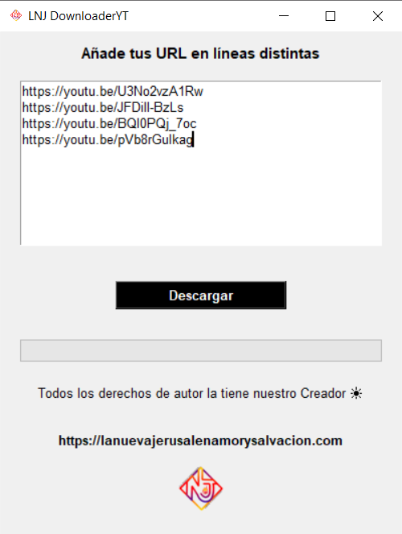

<h1 >LNJ Downloader YT</h1>
<div >
    
</div>
<div  >
    <h2>Downloader MP4 & MP3 from LNJ</h2>
    <p>The application allows you to add in multiple Youtube links and download both video and audio, mp4 and mp3 respectively.</p>
    
</div>

---

## Technologies

<svg xmlns="http://www.w3.org/2000/svg" viewBox="0 0 128 128" width=100><linearGradient id="python-original-a" gradientUnits="userSpaceOnUse" x1="70.252" y1="1237.476" x2="170.659" y2="1151.089" gradientTransform="matrix(.563 0 0 -.568 -29.215 707.817)"><stop offset="0" stop-color="#5A9FD4"/><stop offset="1" stop-color="#306998"/></linearGradient><linearGradient id="python-original-b" gradientUnits="userSpaceOnUse" x1="209.474" y1="1098.811" x2="173.62" y2="1149.537" gradientTransform="matrix(.563 0 0 -.568 -29.215 707.817)"><stop offset="0" stop-color="#FFD43B"/><stop offset="1" stop-color="#FFE873"/></linearGradient><path fill="url(#python-original-a)" d="M63.391 1.988c-4.222.02-8.252.379-11.8 1.007-10.45 1.846-12.346 5.71-12.346 12.837v9.411h24.693v3.137H29.977c-7.176 0-13.46 4.313-15.426 12.521-2.268 9.405-2.368 15.275 0 25.096 1.755 7.311 5.947 12.519 13.124 12.519h8.491V67.234c0-8.151 7.051-15.34 15.426-15.34h24.665c6.866 0 12.346-5.654 12.346-12.548V15.833c0-6.693-5.646-11.72-12.346-12.837-4.244-.706-8.645-1.027-12.866-1.008zM50.037 9.557c2.55 0 4.634 2.117 4.634 4.721 0 2.593-2.083 4.69-4.634 4.69-2.56 0-4.633-2.097-4.633-4.69-.001-2.604 2.073-4.721 4.633-4.721z" transform="translate(0 10.26)"/><path fill="url(#python-original-b)" d="M91.682 28.38v10.966c0 8.5-7.208 15.655-15.426 15.655H51.591c-6.756 0-12.346 5.783-12.346 12.549v23.515c0 6.691 5.818 10.628 12.346 12.547 7.816 2.297 15.312 2.713 24.665 0 6.216-1.801 12.346-5.423 12.346-12.547v-9.412H63.938v-3.138h37.012c7.176 0 9.852-5.005 12.348-12.519 2.578-7.735 2.467-15.174 0-25.096-1.774-7.145-5.161-12.521-12.348-12.521h-9.268zM77.809 87.927c2.561 0 4.634 2.097 4.634 4.692 0 2.602-2.074 4.719-4.634 4.719-2.55 0-4.633-2.117-4.633-4.719 0-2.595 2.083-4.692 4.633-4.692z" transform="translate(0 10.26)"/><radialGradient id="python-original-c" cx="1825.678" cy="444.45" r="26.743" gradientTransform="matrix(0 -.24 -1.055 0 532.979 557.576)" gradientUnits="userSpaceOnUse"><stop offset="0" stop-color="#B8B8B8" stop-opacity=".498"/><stop offset="1" stop-color="#7F7F7F" stop-opacity="0"/></radialGradient><path opacity=".444" fill="url(#python-original-c)" d="M97.309 119.597c0 3.543-14.816 6.416-33.091 6.416-18.276 0-33.092-2.873-33.092-6.416 0-3.544 14.815-6.417 33.092-6.417 18.275 0 33.091 2.872 33.091 6.417z"/></svg>


### **Python** 

- tkinter,
- pytube, 
- moviepy, 
- threading,
- webbrowser,
- sys,
- os

## [Dependencies](./requeriments.txt)

```bash
pip freeze > requeriments.txt
```
## [Executable](./output/LNJ_Downloader_YT.exe)

You can download the exe in the output folder, script packaged with pyinstaller.

```bash
pip install pyinstaller
# simple configuration
pyinstaller --onefile LNJ_Downloader_YT.py

# works with pyinstaller, but has a graphical interface
pip install auto-py-to-exe
auto-py-to-exe
```
> https://github.com/brentvollebregt/auto-py-to-exe

Relative paths for the images, so pyinstaller can pack them.
_MEIPASS lets us know whether we are in development or not

```python
def resolver_ruta(ruta_relativa):
    if hasattr(sys, "_MEIPASS"):
        return os.path.join(sys._MEIPASS, ruta_relativa)
    return os.path.join(os.path.abspath("."), ruta_relativa)
```
Solution for the executable with pyinstaller,
since moviepy required an output and needed the console.
This would be like an application log

```python
output = open("output.txt", "wt")
sys.stdout = output
sys.stderr = output
```

You can also clone this repository and run the script:

```bash
phyton .\LNJ_Downloader_YT.py
```

---

<small>
    Important Notice: When using our application, please remember that downloading YouTube content may infringe upon copyright laws and the rights of content creators. We strongly advise responsible and legal usage of downloaded content, ensuring compliance with YouTube's terms of use. Users are solely responsible for their actions, and our application and team cannot be held liable for any misuse or illegal use of downloaded content. Please utilize our application ethically, respecting copyright laws and usage policies.
</small>

<small><a href="https://lanuevajerusalenamorysalvacion.com">https://lanuevajerusalenamorysalvacion.com</a></small>